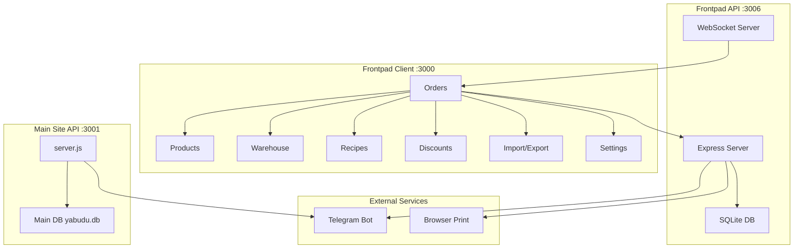

# Архитектурный план развития Frontpad и системы ya_budu

## 1. Telegram Интеграция для переадресации сообщений

### 1.1 Описание функционала
Когда пользователь пишет сообщение в мессенджере на сайте (через компонент ClientChat), сообщение должно автоматически пересылаться в Telegram бота администратора.

### 1.2 Архитектура

```
Пользователь сайта → ClientChat (сайт) → API (server.js:3001) → Telegram Bot → Админ
                          ↓
                   WebSocket уведомление → Frontpad
```

### 1.3 Компоненты

#### 1.3.1 Серверная часть (server.js)
- Добавить endpoint `/api/telegram/send-message` для отправки сообщений в Telegram
- Интеграция с Telegram Bot API через библиотеку `node-telegram-bot-api`
- Хранение токена бота и chat_id администратора в .env

#### 1.3.2 Клиентская часть (ClientChat.jsx)
- При отправке сообщения пользователем делать запрос к API
- API отправляет сообщение в Telegram

#### 1.3.3 Telegram Bot
- Бот принимает сообщения от API
- Может отвечать пользователю через бота (обратная связь)

### 1.4 API Эндпоинты

```
POST /api/telegram/send-message
{
  "message": "Текст сообщения",
  "customer_name": "Имя клиента",
  "customer_phone": "Телефон"
}

POST /api/telegram/send-order-notification
{
  "order_id": 123,
  "message": "Текст уведомления"
}
```

---

## 2. Автоматическая печать чеков

### 2.1 Описание функционала
Добавить переключатель в Frontpad для включения/выключения автоматической печати чеков при поступлении нового заказа.

### 2.2 Компоненты

#### 2.2.1 Настройки в базе данных
Создать таблицу `settings`:
```sql
CREATE TABLE IF NOT EXISTS settings (
  key TEXT PRIMARY KEY,
  value TEXT
);

INSERT INTO settings (key, value) VALUES 
('auto_print_enabled', 'false'),
('telegram_token', ''),
('telegram_chat_id', ''),
('low_stock_threshold', '10');
```

#### 2.2.2 API для настроек
```
GET  /api/settings
PUT  /api/settings
POST /api/settings/auto-print (включить/выключить автопечать)
```

#### 2.2.3 Frontpad интерфейс
- Добавить страницу "Настройки" (/settings)
- Переключатель "Автоматическая печать чеков"
- Поля для Telegram настроек
- Поле для порога уведомления о низком остатке

#### 2.2.4 Логика работы
```javascript
// При создании заказа
if (autoPrintEnabled && order.status === 'pending') {
  printReceipt(order);
}
```

---

## 3. Складской учёт и себестоимость

### 3.1 Описание функционала
Система учёта сырья, автоматический расчёт себестоимости блюд, списание при заказах, уведомления о минимальном остатке.

### 3.2 Структура базы данных

#### 3.2.1 Таблица ингредиентов (ingredients)
```sql
CREATE TABLE IF NOT EXISTS ingredients (
  id INTEGER PRIMARY KEY AUTOINCREMENT,
  name TEXT NOT NULL,
  unit TEXT NOT NULL,          -- кг, г, шт, л, мл
  current_quantity REAL DEFAULT 0,
  min_quantity REAL DEFAULT 10,  -- порог для уведомления
  cost_per_unit REAL,          -- стоимость за единицу
  created_at DATETIME DEFAULT CURRENT_TIMESTAMP,
  updated_at DATETIME DEFAULT CURRENT_TIMESTAMP
);
```

#### 3.2.2 Таблица рецептур (recipes)
```sql
CREATE TABLE IF NOT EXISTS recipes (
  id INTEGER PRIMARY KEY AUTOINCREMENT,
  product_id INTEGER,
  ingredient_id INTEGER,
  quantity REAL NOT NULL,      -- количество ингредиента
  FOREIGN KEY (product_id) REFERENCES products(id),
  FOREIGN KEY (ingredient_id) REFERENCES ingredients(id)
);
```

#### 3.2.3 Таблица складских операций (stock_movements)
```sql
CREATE TABLE IF NOT EXISTS stock_movements (
  id INTEGER PRIMARY KEY AUTOINCREMENT,
  ingredient_id INTEGER,
  quantity REAL NOT NULL,      -- положительное = приход, отрицательное = расход
  reason TEXT,                 -- 'order', 'manual', 'supplier'
  order_id INTEGER,            -- если связано с заказом
  created_at DATETIME DEFAULT CURRENT_TIMESTAMP,
  FOREIGN KEY (ingredient_id) REFERENCES ingredients(id)
);
```

### 3.3 API Эндпоинты

#### Ингредиенты
```
GET    /api/ingredients
GET    /api/ingredients/:id
POST   /api/ingredients
PUT    /api/ingredients/:id
DELETE /api/ingredients/:id
POST   /api/ingredients/:id/stock  -- добавить/убрать со склада
```

#### Рецептуры
```
GET    /api/recipes/product/:product_id  -- получить рецептуру блюда
POST   /api/recipes                      -- добавить ингредиент в блюдо
PUT    /api/recipes/:id                  -- обновить количество
DELETE /api/recipes/:id                  -- удалить ингредиент из блюда
```

#### Калькуляция
```
GET  /api/products/:id/cost              -- получить себестоимость блюда
GET  /api/products/cost-report           -- отчёт по себестоимости всех блюд
```

#### Складские движения
```
GET  /api/stock/movements?ingredient_id=123
GET  /api/stock/alerts                   -- получить ингредиенты с низким остатком
```

### 3.4 Frontpad интерфейс

#### 3.4.1 Страница "Склад" (/warehouse)
- Список всех ингредиентов с текущим остатком
- Кнопка добавления нового ингредиента
- Кнопка редактирования
- Кнопка "Пополнить склад"
- Индикация низкого остатка (красный цвет)
- Фильтры и поиск

#### 3.4.2 Страница "Рецептуры" (/recipes)
- Список блюд с рецептами
- Возможность добавить/редактировать ингредиенты блюда
- Отображение себестоимости и наценки

#### 3.4.3 Модальное окно "Добавить ингредиент"
- Название
- Единица измерения (кг, г, шт, л, мл)
- Текущее количество
- Минимальное количество (для уведомлений)
- Стоимость за единицу

#### 3.4.4 Модальное окно "Редактировать рецептуру"
- Список ингредиентов с количеством
- Возможность добавить ингредиент из справочника
- Автоматический расчёт себестоимости

### 3.5 Логика списания при заказе

```javascript
// При подтверждении заказа
async function processOrderIngredients(order) {
  for (const item of order.items) {
    const recipe = await getRecipe(item.product_id);
    for (const ingredient of recipe) {
      const usedQuantity = ingredient.quantity * item.quantity;
      
      // Списать со склада
      await db.run(`
        UPDATE ingredients 
        SET current_quantity = current_quantity - ?,
            updated_at = CURRENT_TIMESTAMP
        WHERE id = ?
      `, [usedQuantity, ingredient.ingredient_id]);
      
      // Записать движение
      await db.run(`
        INSERT INTO stock_movements 
        (ingredient_id, quantity, reason, order_id)
        VALUES (?, ?, 'order', ?)
      `, [ingredient.ingredient_id, -usedQuantity, order.id]);
      
      // Проверить порог минимального остатка
      const ingredient = await getIngredient(ingredient.ingredient_id);
      if (ingredient.current_quantity <= ingredient.min_quantity) {
        // Отправить уведомление
        await sendLowStockAlert(ingredient);
      }
    }
  }
}
```

---

## 4. Система скидок

### 4.1 Описание функционала
Возможность создавать скидки во Frontpad с синхронизацией на сайт.

### 4.2 Структура базы данных

```sql
CREATE TABLE IF NOT EXISTS discounts (
  id INTEGER PRIMARY KEY AUTOINCREMENT,
  name TEXT NOT NULL,
  type TEXT NOT NULL,          -- 'percentage' или 'fixed'
  value REAL NOT NULL,         -- размер скидки
  products TEXT,               -- JSON массив ID товаров (NULL = все товары)
  categories TEXT,             -- JSON массив ID категорий (NULL = все)
  start_date DATE,
  end_date DATE,
  is_active INTEGER DEFAULT 1,
  created_at DATETIME DEFAULT CURRENT_TIMESTAMP
);
```

### 4.3 API Эндпоинты

```
GET    /api/discounts
GET    /api/discounts/:id
POST   /api/discounts
PUT    /api/discounts/:id
DELETE /api/discounts/:id
PUT    /api/discounts/:id/toggle  -- включить/выключить
GET    /api/discounts/active      -- активные скидки для сайта
```

### 4.4 Frontpad интерфейс

#### Страница "Скидки" (/discounts)
- Список всех скидок
- Кнопка создания новой скидки
- Статус (активна/неактивна)
- Период действия
- Тип и размер скидки

#### Модальное окно "Создать/редактировать скидку"
- Название
- Тип: Процент / Фиксированная сумма
- Значение
- Применить к: Все товары / Категории / Конкретные товары
- Дата начала
- Дата окончания

---

## 5. Импорт/Экспорт через Excel

### 5.1 Описание функционала
Возможность импортировать и экспортировать товары, ингредиенты, скидки через файлы Excel.

### 5.2 Библиотеки
- Чтение/запись Excel: `xlsx` (SheetJS)
- Для frontend: `xlsx` или `exceljs`

### 5.3 API Эндпоинты

```
POST /api/import/products    -- импорт товаров
POST /api/import/ingredients -- импорт ингредиентов
POST /api/import/recipes     -- импорт рецептур

GET /api/export/products     -- экспорт товаров
GET /api/export/ingredients  -- экспорт ингредиентов
GET /api/export/recipes      -- экспорт рецептур
GET /api/export/orders       -- экспорт заказов
```

### 5.4 Форматы Excel

#### 5.4.1 Импорт товаров (products_import.xlsx)
| name | description | price | category | is_active |
|------|-------------|-------|----------|-----------|
| Пицца Маргарита | ... | 450 | Пицца | 1 |

#### 5.4.2 Импорт ингредиентов (ingredients_import.xlsx)
| name | unit | current_quantity | min_quantity | cost_per_unit |
|------|------|------------------|--------------|---------------|
| Рис | кг | 10 | 5 | 150 |
| Лосось | кг | 5 | 2 | 1200 |

#### 5.4.3 Импорт рецептур (recipes_import.xlsx)
| product_name | ingredient_name | quantity |
|--------------|-----------------|----------|
| Ролл Филадельфия | Рис | 0.2 |
| Ролл Филадельфия | Лосось | 0.05 |

### 5.5 Frontpad интерфейс

#### Страница "Импорт/Экспорт" (/import-export)
- Вкладка "Товары"
  - Кнопка "Скачать шаблон"
  - Кнопка "Выбрать файл"
  - Кнопка "Импортировать"
  - Кнопка "Экспортировать всё"
- Вкладка "Ингредиенты"
  - Аналогично
- Вкладка "Рецептуры"
  - Аналогично

---

## 6. Уведомления о новых заказах

### 6.1 Описание
Улучшить существующую систему уведомлений - добавить звуковое уведомление, более заметный баннер.

### 6.2 Frontpad улучшения
- Звуковой сигнал при новом заказе
- Анимация мигания заголовка
- Кнопка "Принять" с подтверждением
- Уведомление "Непрочитанные заказы" в заголовке

---

## Диаграмма архитектуры системы



---

## Приоритет реализации

1. **Высокий приоритет:**
   - Автоматическая печать чеков
   - Складской учёт (базовый)
   - Уведомления о заказах

2. **Средний приоритет:**
   - Telegram интеграция
   - Система скидок
   - Импорт/Экспорт товаров

3. **Низкий приоритет:**
   - Расширенная аналитика
   - Импорт рецептур
   - Мобильное приложение
