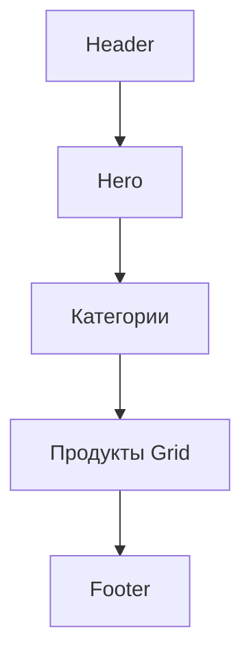

# Идеальный дизайн сайта доставки еды

## Общая концепция
Сайт должен быть минималистичным, современным и ориентированным на мобильные устройства. Цветовая палитра: черный, желтый, белый. Темная тема для элегантности, с акцентами желтого. Быстрый, интуитивный UX с плавными анимациями.

## Цветовая схема
- Основной фон: черный (#000000)
- Акцентный цвет: ярко-желтый (#FFD700)
- Текст: белый (#FFFFFF)
- Вторичный: светло-серый (#333333)

## Шрифты
- Основной: Montserrat (sans-serif)
- Заголовки: Montserrat Bold
- Размер: 14px для текста, 18px для заголовков

## Layout
Использовать Flexbox и Grid для адаптивности.

### Header
- Фиксированный сверху
- Логотип слева (желтый текст)
- Навигация по центру (табы: Главная, Меню, О нас, Контакты)
- Корзина и профиль справа
- Фон: полупрозрачный черный с blur

### Hero секция
- Полноэкранный баннер с фоновым изображением еды
- Центральный текст: "Вкусная еда с доставкой"
- Кнопка "Заказать сейчас" (желтая)
- Анимация: fade-in и parallax

### Категории меню
- Горизонтальные табы под Hero
- Активная категория выделена желтым
- Hover эффекты с плавным переходом

### Секция продуктов
- Grid 3 колонки на десктопе, 1-2 на мобильном
- Карточки продуктов: изображение, название, цена, кнопка "Добавить"
- Hover: подъем карточки, тень

### Footer
- 3 колонки: контакты, ссылки, социальные сети
- Фон: черный
- Текст: белый

## Анимации
- Micro-interactions: hover на кнопках (scale 1.05)
- Loading: skeleton screens
- Transitions: 0.3s ease-in-out

## Адаптивность
- Mobile-first подход
- Breakpoints: 768px, 1024px
- На мобильном: hamburger menu, вертикальные категории

## Дополнительные элементы
- Поисковая строка в Header
- Фильтры по категориям
- Модальное окно корзины
- Toast уведомления для добавления в корзину

## Mermaid диаграмма layout

Этот дизайн сделает сайт привлекательным, функциональным и современным.