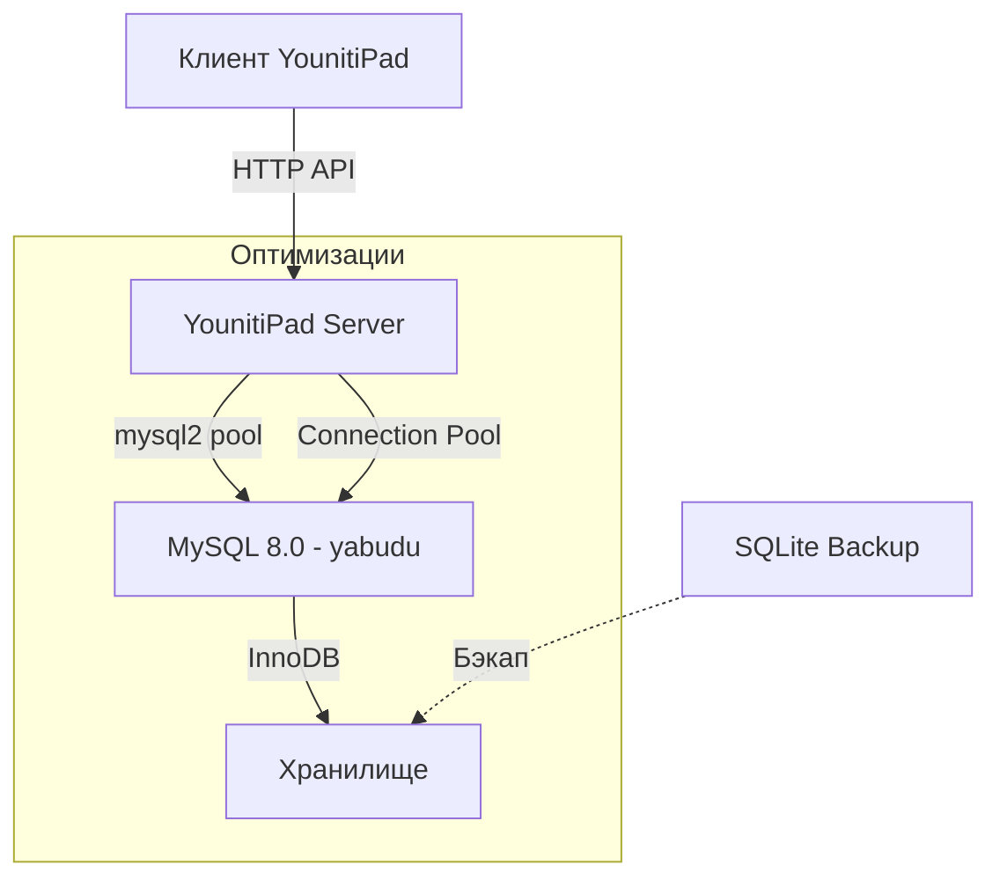

# План миграции с SQLite на MySQL

## Параметры подключения MySQL
- **Хост**: localhost
- **Порт**: 3306
- **Пользователь**: root
- **Пароль**: 12345
- **База данных**: yabudu

## Этапы миграции

### Этап 1: Создание БД и таблиц в MySQL
- [ ] Создать базу данных `yabudu` в MySQL
- [ ] Создать все необходимые таблицы с MySQL-совместимой схемой
- [ ] Добавить индексы для оптимизации запросов

### Этап 2: Перенос данных из SQLite в MySQL
- [ ] Создать скрипт миграции `migrate_to_mysql.js`
- [ ] Перенести данные из каждой таблицы SQLite в MySQL
- [ ] Проверить целостность данных после миграции

### Этап 3: Обновление сервера YounitiPad
- [ ] Добавить зависимость mysql2 в package.json
- [ ] Обновить `index.js` для работы с MySQL вместо SQLite
- [ ] Обновить логику подключения и запросов
- [ ] Добавить пул соединмизации

### Этапений для опти 4: Тестирование
- [ ] Перезапустить YounitiPad Server
- [ ] Проверить загрузку категорий и товаров
- [ ] Проверить создание и редактирование заказов
- [ ] Проверить работу вкладки "Заказы" (изначальная проблема)
- [ ] Проверить производительность

### Этап 5: Бэкап и откат (при необходимости)
- [ ] Создать бэкап текущей SQLite базы
- [ ] Подготовить инструкцию по откату на SQLite

## Таблицы для миграции

### Основные таблицы
| SQLite | MySQL | Описание |
|--------|-------|----------|
| products | products | Товары |
| categories | categories | Категории |
| orders | orders | Заказы |
| customers | customers | Клиенты |

### Справочные таблицы
| SQLite | MySQL | Описание |
|--------|-------|----------|
| sizes | sizes | Размеры товаров |
| addon_templates | addon_templates | Шаблоны дополнений |
| product_addons | product_addons | Связь товаров с дополнениями |
| product_discounts | product_discounts | Скидки на товары |

### Складской учёт
| SQLite | MySQL | Описание |
|--------|-------|----------|
| ingredients | ingredients | Ингредиенты |
| recipes | recipes | Рецептуры товаров |
| inventory_movements | inventory_movements | Движения по складу |

### Комбо и скидки
| SQLite | MySQL | Описание |
|--------|-------|----------|
| combo_products | combo_products | Комбо-наборы |
| combo_items | combo_items | Состав комбо-наборов |
| discounts | discounts | Общие скидки |
| order_discounts | order_discounts | Скидки в заказах |

### Системные
| SQLite | MySQL | Описание |
|--------|-------|----------|
| settings | settings | Настройки системы |

## Изменения в схеме для MySQL

### Пример SQL для создания таблицы products
```sql
CREATE TABLE products (
  id INT AUTO_INCREMENT PRIMARY KEY,
  name VARCHAR(255) NOT NULL,
  description TEXT,
  price DECIMAL(10, 2) DEFAULT 0,
  category_id INT,
  image_url VARCHAR(500),
  is_active INT DEFAULT 1,
  is_hidden INT DEFAULT 0,
  discount_price DECIMAL(10, 2) DEFAULT 0,
  sort_order INT DEFAULT 0,
  is_combo INT DEFAULT 0,
  created_at DATETIME DEFAULT CURRENT_TIMESTAMP,
  updated_at DATETIME DEFAULT CURRENT_TIMESTAMP,
  INDEX idx_category (category_id),
  INDEX idx_active (is_active),
  INDEX idx_name (name)
) ENGINE=InnoDB DEFAULT CHARSET=utf8mb4 COLLATE=utf8mb4_unicode_ci;
```

## Архитектура после миграции


