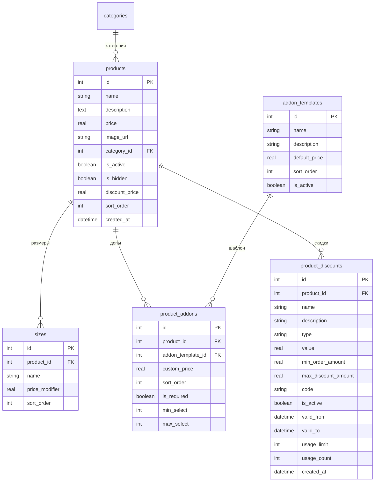

# Структура БД для товаров с размерами, допами и скидками

## Обзор

Текущая структура БД (SQLite) уже частично поддерживает размеры и допы, но требует расширения для:
1. Глобального справочника допов
2. Привязки допов к товарам с возможностью переопределения цены
3. Скидок на конкретные товары
4. Дополнительных полей в таблице products

---

## Схема таблиц



---

## Детальное описание таблиц

### 1. `addon_templates` - Глобальный справочник допов

```sql
CREATE TABLE IF NOT EXISTS addon_templates (
    id INTEGER PRIMARY KEY AUTOINCREMENT,
    name TEXT NOT NULL UNIQUE,
    description TEXT,
    default_price REAL DEFAULT 0,
    sort_order INTEGER DEFAULT 0,
    is_active INTEGER DEFAULT 1,
    created_at DATETIME DEFAULT CURRENT_TIMESTAMP,
    updated_at DATETIME DEFAULT CURRENT_TIMESTAMP
);
```

**Пример данных:**
| id | name | description | default_price | sort_order | is_active |
|----|------|-------------|---------------|------------|-----------|
| 1 | Дополнительный сыр | Огурец маринованный | 50 | 1 | 1 |
| 2 | Грибы | Жареные шампиньоны | 30 | 2 | 1 |
| 3 | Бекон | Хрустящий бекон | 70 | 3 | 1 |
| 4 | Острый перец | Халапеньо | 25 | 4 | 1 |

### 2. `product_addons` - Связь товаров с глобальными допами

```sql
CREATE TABLE IF NOT EXISTS product_addons (
    id INTEGER PRIMARY KEY AUTOINCREMENT,
    product_id INTEGER NOT NULL,
    addon_template_id INTEGER NOT NULL,
    custom_price REAL,
    sort_order INTEGER DEFAULT 0,
    is_required INTEGER DEFAULT 0,
    min_select INTEGER DEFAULT 0,
    max_select INTEGER DEFAULT 0,
    created_at DATETIME DEFAULT CURRENT_TIMESTAMP,
    FOREIGN KEY (product_id) REFERENCES products(id) ON DELETE CASCADE,
    FOREIGN KEY (addon_template_id) REFERENCES addon_templates(id) ON DELETE CASCADE,
    UNIQUE(product_id, addon_template_id)
);
```

**Пример данных:**
| id | product_id | addon_template_id | custom_price | sort_order | is_required | min_select | max_select |
|----|------------|-------------------|--------------|------------|-------------|------------|------------|
| 1 | 1 (Пицца) | 1 (Сыр) | 80 | 1 | 0 | 0 | 3 |
| 2 | 1 (Пицца) | 2 (Грибы) | 50 | 2 | 0 | 0 | 2 |
| 3 | 2 (Бургер) | 3 (Бекон) | 70 | 1 | 0 | 0 | 2 |

### 3. `product_discounts` - Скидки на конкретные товары

```sql
CREATE TABLE IF NOT EXISTS product_discounts (
    id INTEGER PRIMARY KEY AUTOINCREMENT,
    product_id INTEGER NOT NULL,
    name TEXT NOT NULL,
    description TEXT,
    type TEXT NOT NULL DEFAULT 'percent',
    value REAL NOT NULL,
    min_order_amount REAL DEFAULT 0,
    max_discount_amount REAL,
    code TEXT UNIQUE,
    is_active INTEGER DEFAULT 1,
    valid_from TEXT,
    valid_to TEXT,
    usage_limit INTEGER,
    usage_count INTEGER DEFAULT 0,
    created_at DATETIME DEFAULT CURRENT_TIMESTAMP,
    updated_at DATETIME DEFAULT CURRENT_TIMESTAMP,
    FOREIGN KEY (product_id) REFERENCES products(id) ON DELETE CASCADE
);
```

**Пример данных:**
| id | product_id | name | type | value | min_order_amount | is_active |
|----|------------|------|------|-------|-----------------|-----------|
| 1 | 1 (Пицца) | Скидка 20% на пиццу | percent | 20 | 500 | 1 |
| 2 | 2 (Бургер) | 2 по цене 1 | fixed | 0 | 1000 | 1 |

### 4. Обновлённая таблица `products`

```sql
ALTER TABLE products ADD COLUMN is_active INTEGER DEFAULT 1;
ALTER TABLE products ADD COLUMN is_hidden INTEGER DEFAULT 0;
ALTER TABLE products ADD COLUMN discount_price REAL;
ALTER TABLE products ADD COLUMN sort_order INTEGER DEFAULT 0;
```

---

## API эндпоинты для новой структуры

### Глобальные допы
- `GET /api/addon-templates` - получить все шаблоны допов
- `POST /api/addon-templates` - создать шаблон (админ)
- `PUT /api/addon-templates/:id` - обновить шаблон (админ)
- `DELETE /api/addon-templates/:id` - удалить шаблон (админ)

### Связь допов с товарами
- `GET /api/products/:productId/product-addons` - получить допы товара
- `POST /api/products/:productId/product-addons` - добавить доп к товару (админ)
- `PUT /api/product-addons/:id` - обновить связь (админ)
- `DELETE /api/product-addons/:id` - удалить доп из товара (админ)

### Скидки на товары
- `GET /api/products/:productId/discounts` - получить скидки товара
- `POST /api/products/:productId/discounts` - создать скидку (админ)
- `PUT /api/product-discounts/:id` - обновить скидку (админ)
- `DELETE /api/product-discounts/:id` - удалить скидку (админ)

---

## Примеры использования

### Создание товара с размерами и допами

```javascript
// Создать товар "Пицца Пепперони"
const product = await db.run(
    'INSERT INTO products (name, description, price, category_id, is_active, sort_order) VALUES (?, ?, ?, ?, ?, ?)',
    ['Пицца Пепперони', 'Острая пепперони...', 599, 1, 1, 1]
);

// Добавить размеры
await db.run('INSERT INTO sizes (product_id, name, price_modifier, sort_order) VALUES (?, ?, ?, ?)',
    [product.lastID, '25 см', 0, 1]);
await db.run('INSERT INTO sizes (product_id, name, price_modifier, sort_order) VALUES (?, ?, ?, ?)',
    [product.lastID, '35 см', 200, 2]);
await db.run('INSERT INTO sizes (product_id, name, price_modifier, sort_order) VALUES (?, ?, ?, ?)',
    [product.lastID, '50 см', 400, 3]);

// Добавить допы к товару (из глобального справочника)
await db.run('INSERT INTO product_addons (product_id, addon_template_id, custom_price, sort_order) VALUES (?, ?, ?, ?)',
    [product.lastID, 1, 80, 1]); // Сыр +80 руб
await db.run('INSERT INTO product_addons (product_id, addon_template_id, custom_price, sort_order) VALUES (?, ?, ?, ?)',
    [product.lastID, 2, 50, 2]); // Грибы +50 руб
await db.run('INSERT INTO product_addons (product_id, addon_template_id, custom_price, sort_order, is_required, min_select) VALUES (?, ?, ?, ?, ?, ?)',
    [product.lastID, 4, 25, 3, 1, 1]); // Острый перец (обязательно)
```

### Получение товара с размерами и допами

```sql
SELECT 
    p.*,
    json_group_array(
        json_object(
            'id', s.id,
            'name', s.name,
            'price_modifier', s.price_modifier
        )
    ) as sizes
FROM products p
LEFT JOIN sizes s ON p.id = s.product_id
WHERE p.id = 1
GROUP BY p.id;
```

---

## SQL миграция

```sql
-- 1. Добавить поля в products
ALTER TABLE products ADD COLUMN is_active INTEGER DEFAULT 1;
ALTER TABLE products ADD COLUMN is_hidden INTEGER DEFAULT 0;
ALTER TABLE products ADD COLUMN discount_price REAL;
ALTER TABLE products ADD COLUMN sort_order INTEGER DEFAULT 0;

-- 2. Создать таблицу глобальных допов
CREATE TABLE IF NOT EXISTS addon_templates (
    id INTEGER PRIMARY KEY AUTOINCREMENT,
    name TEXT NOT NULL UNIQUE,
    description TEXT,
    default_price REAL DEFAULT 0,
    sort_order INTEGER DEFAULT 0,
    is_active INTEGER DEFAULT 1,
    created_at DATETIME DEFAULT CURRENT_TIMESTAMP,
    updated_at DATETIME DEFAULT CURRENT_TIMESTAMP
);

-- 3. Создать таблицу связей товаров с допами
CREATE TABLE IF NOT EXISTS product_addons (
    id INTEGER PRIMARY KEY AUTOINCREMENT,
    product_id INTEGER NOT NULL,
    addon_template_id INTEGER NOT NULL,
    custom_price REAL,
    sort_order INTEGER DEFAULT 0,
    is_required INTEGER DEFAULT 0,
    min_select INTEGER DEFAULT 0,
    max_select INTEGER DEFAULT 0,
    created_at DATETIME DEFAULT CURRENT_TIMESTAMP,
    FOREIGN KEY (product_id) REFERENCES products(id) ON DELETE CASCADE,
    FOREIGN KEY (addon_template_id) REFERENCES addon_templates(id) ON DELETE CASCADE,
    UNIQUE(product_id, addon_template_id)
);

-- 4. Создать таблицу скидок на товары
CREATE TABLE IF NOT EXISTS product_discounts (
    id INTEGER PRIMARY KEY AUTOINCREMENT,
    product_id INTEGER NOT NULL,
    name TEXT NOT NULL,
    description TEXT,
    type TEXT NOT NULL DEFAULT 'percent',
    value REAL NOT NULL,
    min_order_amount REAL DEFAULT 0,
    max_discount_amount REAL,
    code TEXT UNIQUE,
    is_active INTEGER DEFAULT 1,
    valid_from TEXT,
    valid_to TEXT,
    usage_limit INTEGER,
    usage_count INTEGER DEFAULT 0,
    created_at DATETIME DEFAULT CURRENT_TIMESTAMP,
    updated_at DATETIME DEFAULT CURRENT_TIMESTAMP,
    FOREIGN KEY (product_id) REFERENCES products(id) ON DELETE CASCADE
);

-- 5. Перенести существующие addons в addon_templates
INSERT INTO addon_templates (name, description, default_price, sort_order, is_active)
SELECT DISTINCT name, '', price, sort_order, 1
FROM addons;

-- 6. Создать связи product_addons из существующих addons
INSERT INTO product_addons (product_id, addon_template_id, custom_price, sort_order)
SELECT a.product_id, t.id, a.price, a.sort_order
FROM addons a
JOIN addon_templates t ON a.name = t.name;

-- 7. Можно удалить старую таблицу (после миграции)
-- DROP TABLE IF EXISTS addons;
```

---

## Файлы для реализации

1. `migrations/add_product_fields.js` - миграция для добавления полей в products
2. `migrations/create_addon_tables.js` - создание таблиц addon_templates и product_addons
3. `migrations/create_product_discounts.js` - создание таблицы product_discounts
4. `routes/addonTemplates.js` - API для управления глобальными допами
5. `routes/productAddons.js` - API для связи допов с товарами
6. `routes/productDiscounts.js` - API для скидок на товары
